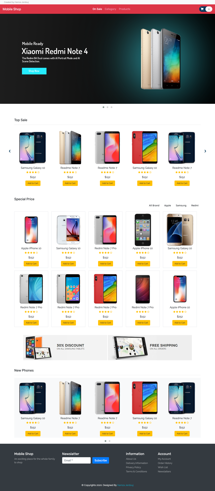
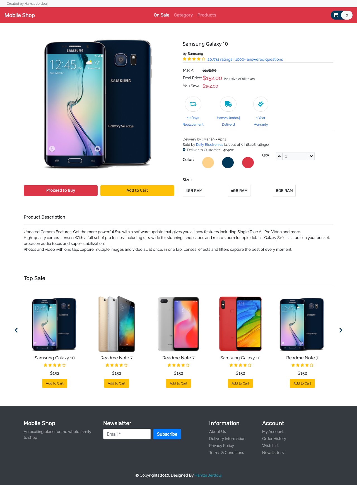
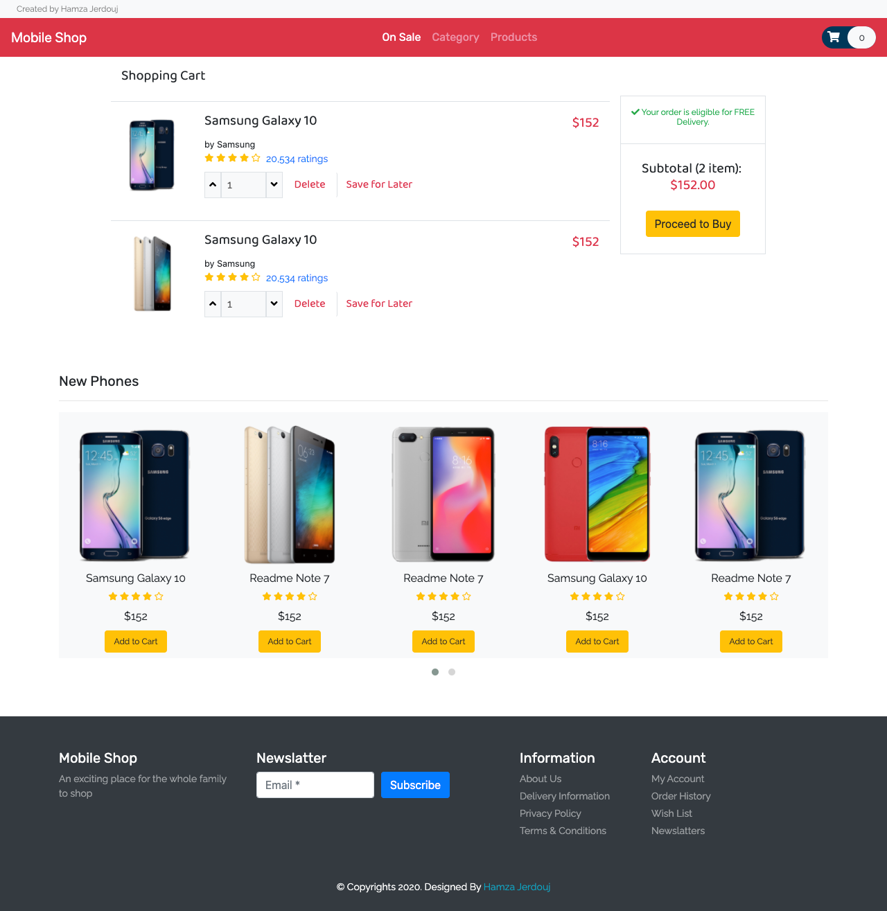

# MobileShop
> A static website of a mobile devices store
# Introduction


This is a static website of mobile devices store.
# Screenshots
> Home Page



> Single Product



> Cart



# Download

```bash
git clone https://github.com/HamzJERDOUJ/MobileShop.git
```

# Contributions

Contributions are always **welcome and recommended**! Here is how:

- Fork the repository
- Clone to your machine
- Create a new branch
- Make your changes
- Create a pull request

# License

This project is licensed under [MIT](https://opensource.org/licenses/MIT).


